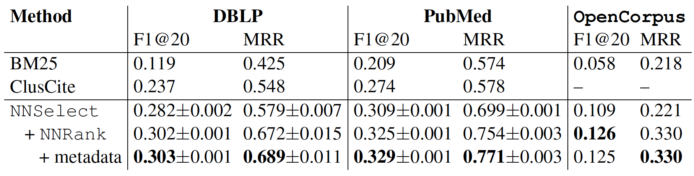

<p align="center"></p>

A citation recommendation system that allows users to find relevant citations for their paper drafts. The tool is backed by [Semantic Scholar](https://www.semanticscholar.org/)'s [OpenCorpus](https://api.semanticscholar.org/corpus/download/) dataset (released on `2017-02-21`). 

This repository contains code to train and evaluate citation recommendation models. We also include our trained models and steps to replicate our results in the NAACL paper.

## Paper
[**Content-based Citation Recommendation (NAACL 2018)**](https://arxiv.org/abs/1802.08301)

  * Main Results
  

## Data
You can download the associated OpenCorpus dataset [here](http://labs.semanticscholar.org/corpus/corpus/archive#).

For models and data associated with experiments from the paper, please refer [below](#download).

## Clone the repo
```
git clone git@github.com:allenai/citeomatic.git
```

## Installation
  1. [Download and install Conda](https://conda.io/docs/download.html)
		
  2. [**Optional**] Install direnv 
  
     Citeomatic uses [direnv](https://github.com/direnv/direnv) to activate the `ai2-citeomatic` conda environment whenever you `cd` into the repo's root directory. Alternatively, you can skip this step and activate the conda environment manually yourself.
      
     * Install `direnv`:
     	* Ubuntu: 
     		```
     		sudo apt-get install direnv
     		```
     	* OSX:
     		```
     		brew install direnv
     		```
     	Then:
     		```
     		cd citeomatic/ ;
     		direnv allow .
     		```
  3. Install GPU Drivers
  
  		Citeomatic uses the tensorflow framework to run its neural network models. It was tested on 
NVIDIA GPUs (GeForce GTX 1080 and Tesla V100-SXM2). To use GPUs, install `CUDA` and `cudnn` compatible with your OS and GPU. The version of `tensorflow` used in this repo is 1.12, and requires CUDA 9.0.

      **NOTE**: Citeomatic can run without a GPU.  

  4. Run: 
		
		`./env.sh`
		
		The script will setup a new conda environment named `ai2-citeomatic`. It will also install the required dependencies. Depending on whether a GPU is found, the script will install `tensorflow-gpu` or `tensorflow`. 
		
  5. Activate Conda Environment
  
  		`source activate ai2-citeomatic`.

#### Common Installation Issues
  1. If you see this error when running any of our scripts:
```
ImportError: libcusolver.so.9.0: cannot open shared object file: No such file or directory
```
please set the environment variable: `export LD_LIBRARY_PATH=/usr/local/cuda/lib64/`

  2. If you have multiple GPUs, please set the environment variable `export 
  CUDA_VISIBLE_DEVICES=<gpu number>`. Citeomatic does not use more than 1 GPU but tensorflow will
   spawn a process on all available GPUs. 

## <a name="download"></a>Download data
```
./get-data.sh citeomatic_data 
```
The script downloads all the required data (~75G) and trained models to `citeomatic_data`. Alternatively, if you provide a different `destination`, the script will create a symlink from `data` to the provided `<destination>`.

**ATTENTION AI2 Internal Users**: If you have access to the AI2 Corp network, please contact one of the contributors for tips on how to avoid downloading data.


## Citeomatic Evaluation

This section details how to run the end-to-end system using pre-trained models
and evaluate performance of Citeomatic for each dataset. If you successfully executed the previous steps, trained models should already be available.

 * Open Corpus
 
 	**ATTENTION**: Experimenting with the open corpus dataset needs a system with at least 100G of RAM.  
```bash
python citeomatic/scripts/evaluate.py --dataset_type oc --candidate_selector_type ann --split test --paper_embedder_dir data/open_corpus/models/paper_embedder/ --num_candidates 5 --ranker_type neural --citation_ranker_dir data/open_corpus/models/citation_ranker/ --n_eval 20000
```  


 * Pubmed
```bash
python citeomatic/scripts/evaluate.py --dataset_type pubmed --candidate_selector_type ann --split test --paper_embedder_dir data/comparison/pubmed/models/paper_embedder/ --num_candidates 10 --ranker_type neural --citation_ranker_dir data/comparison/pubmed/models/citation_ranker/

```

 * DBLP
```bash
python citeomatic/scripts/evaluate.py --dataset_type dblp --candidate_selector_type ann --split test --paper_embedder_dir data/comparison/dblp/models/paper_embedder/ --num_candidates 10 --ranker_type neural --citation_ranker_dir data/comparison/dblp/models/citation_ranker/
```

## BM25 Baseline

 * Open Corpus
```bash
python citeomatic/scripts/evaluate.py --dataset_type oc   --candidate_selector_type bm25 --split test --ranker_type none --num_candidates 5
```  

 * Pubmed
```bash
python citeomatic/scripts/evaluate.py --dataset_type pubmed   --candidate_selector_type bm25 --split test --ranker_type none --num_candidates 100
```

 * DBLP
```bash
python citeomatic/scripts/evaluate.py --dataset_type dblp   --candidate_selector_type bm25 --split test --ranker_type none --num_candidates 50
```

## Train.py
The main script to train and tune hyperparameters for various models is `train.py`. Usage:

```bash
python train.py [options]
```

  * General Parameters:
	  * `--mode` (Required): The mode to run the `train.py` script in. Possible values: `train` or 
	  `hyperopt`. The `train` mode will train a single model and save to a given location. The 
	  `hyperopt` mode will run hyperparamter-optimization and return the best found model.
	  * `--dataset_type`: Dataset to use. Possible values: `dblp` (default), `pubmed` or `oc`
	  * `--model_name`: Possible values: `paper_embedder` (default) or `citation_ranker`
	  
  * Parameters specific to Hyperparameter Optimization
	  * `--max_evals_initial`: No. of models to train in the first phase. Our hyperparameter 
	  optimization method runs in two steps. In the first step, a large number of models are run 
	  for a few epochs and the best performing `max_evals_secondary` models are run for more 
	  number of epochs in the second phase.
	  * `--max_evals_secondary`: No. of models to train in the second phase. Best 
	  `max_evals_secondary` models from Phase 1 are trained for a longer time
	  * `--total_samples_initial`: No. of samples to train first phase models on
	  * `--total_samples_secondary`: No. of samples to train second phase models on
	  * `--models_dir_base`: Base directory to store hyperopt results in 
	  * `--n_eval`: No. of validation examples to evaluate a trained model
	  * `--run_identifier`: A string to identify the experiment
	  * `--version`: Version string to be appended to the directory used to store model in
  
  * Parameters specific to Training a single model
      * `hyperopts_results_pkl`: Path to the `.pkl` file generated by the hyperopt mode
      * `options_json`: Optional json file containing all options required to train a model
      
    Refer to the [ModelOptions](citeomatic/models/options.py) class for more options.

### Training

We use the [hyperopt](https://github.com/hyperopt/hyperopt) package to tune hyperparameters. Here 
 we describe how to run hyperopt for both the paper embedder model and the citation ranker and 
 train the citeomatic system.

  * Hyperopt for **Paper Embedder** Model for DBLP 

	```bash
	python citeomatic/scripts/train.py --mode hyperopt --dataset_type dblp --n_eval 500 --model_name paper_embedder --models_dir_base data/hyperopts/dblp/ --version 1 &> data/hyperopts/dblp/dblp.paper_embedder.hyperopt.log
	```
	
	Execution Time: `~19 hours` (For 25 "initial" and 5 "secondary" trial models)
	
  * **Paper Embedder** Model for DBLP
  
	  Create an empty directory:
	  ```bash
	mkdir data/comparison/dblp/models/trained/
	```

	  ```bash
	python citeomatic/scripts/train.py --mode train --dataset_type dblp --n_eval 500 --model_name paper_embedder --hyperopts_results_pkl data/hyperopts/dblp/citeomatic_hyperopt_paper_embedder_dblp_2018-XX-XX_1/hyperopt_results.pickle --models_dir_base data/comparison/dblp/models/trained/ &> data/comparison/dblp/models/dblp.paper_embedder.trained.log
	```
  	This should produce a trained paper_embedder model in the `--models_dir_base data/comparison/dblp/models/trained/paper_embedder/` directory.
  	
  	Execution time: `~5 hours` 
  	
	  * Evaluating the Paper Embedder for DBLP
		  ```bash
		python citeomatic/script/evaluate.py --dataset_type dblp --candidate_selector_type ann --split test --paper_embedder_dir data/comparison/dblp/models/trained/paper_embedder/ --num_candidates 10 --ranker_type none
		```
  
  * Hyperopt for **Citation Ranker** Model
	  ```bash
	python citeomatic/scripts/train.py --mode hyperopt --dataset_type dblp --models_ann_dir data/comparison/dblp/models/trained/paper_embedder/ --n_eval 500 --model_name citation_ranker --models_dir_base data/hyperopts/dblp/ --version 1 &> data/hyperopts/dblp/dblp.citation_ranker.hyperopt.log
	```
	
  * **Citation Ranker** Model for DBLP
	  ```bash
	python citeomatic/scripts/train.py --mode train --dataset_type dblp --hyperopts_results_pkl data/hyperopts/dblp/citeomatic_hyperopt_citation_ranker_dblp_2018-XX-XX_1/hyperopt_results.pickle --n_eval 500 --model_name citation_ranker --models_ann_dir data/comparison/dblp/models/trained/paper_embedder/ --models_dir data/comparison/dblp/models/trained/citation_ranker/ --version 1 &> data/comparison/dblp/models/trained/dblp.citation_ranker.trained.log
	```  

Change the `--dataset_type` parameter to train for the other datasets. Hyperopt on the OC dataset takes a long time. We suggest setting the parameters manually or by using values described in our paper and training the two models as in steps 2 and 4 above.
 
## Miscellaneous

  1. **Create a new BM25 Index**
  
  The `get-data.sh` script also downloaded a pre-built BM25 indexe for each dataset (pubmed, dblp and oc). But, a new index can be built as:
  
```
python citeomatic/scripts/create_bm25_index.py --dataset_name <dataset name> 
```
	
  Modify `CreateBM25Index` to change the way the BM25 index is built. We use the [whoosh](https://pypi.python.org/pypi/Whoosh/) package to build the BM25 index. To change the way the index is queried, change the `fetch_candidates` implementation in `BM25CandidateSelector`

  This script will create an index at this location: `data/bm25_index/<dataset name>/`


  2. **Re-Create SQLite DB for dataset**
  
  This following scripts will create an index at this location: `data/db/<dataset name>.sqlite.db`

  * For the DBLP and Pubmed datasets:
	```
	python citeomatic/scripts/convert_kdd_to_citeomatic.py --dataset_name <dataset name>
	```

  * For the open corpus dataset:
	```
	python citeomatic/scripts/convert_open_corpus_to_citeomatic.py
	```

The SQLite DB is used to speed-up retrieving documents for a particular document id.

## Issues
Please file issues [here](https://github.com/allenai/citeomatic/issues).

## Contact

  1. [chandrab@allenai.org](mailto:chandrab@allenai.org): For enquiries about running experiments
   and replicating results from the paper.
  2. [feedback@semanticscholar.org](mailto:feedback@semanticscholar.org): For other questions and
   feedback about Citeomatic. 
 

## Team

Citeomatic is an open-source project backed by the [Allen Institute for Artificial Intelligence (AI2)](http://www.allenai.org).
AI2 is a non-profit institute with the mission to contribute to humanity through high-impact AI research and engineering.
To learn more about who specifically contributed to this codebase, see [our contributors](https://github.com/allenai/citeomatic/graphs/contributors) page.
